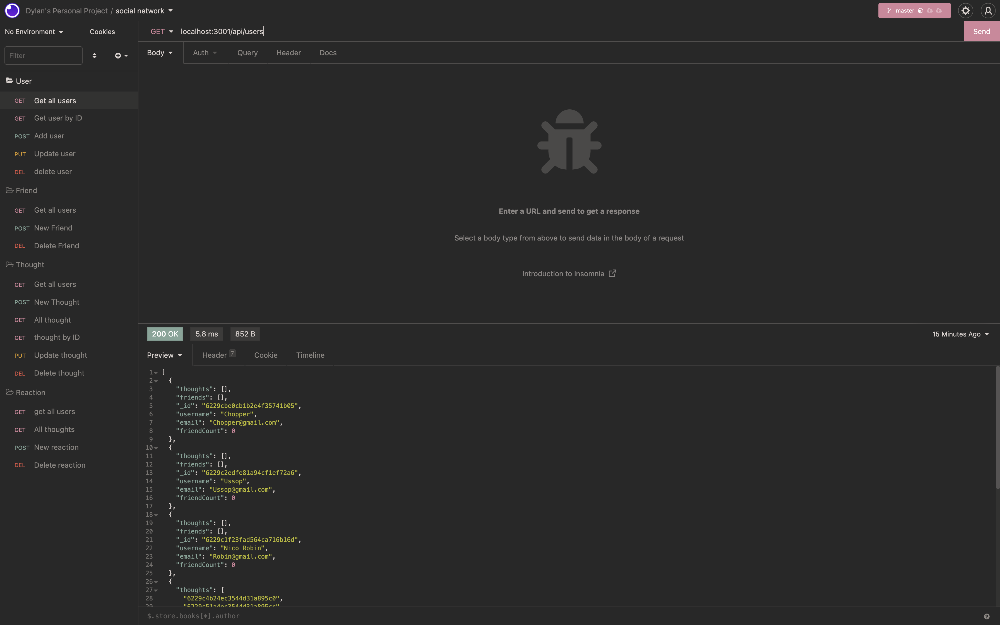

# Social Network API
  ## Table of Contents
  * [Project Description](#project-description)
  * [Installation](#installation)
  * [Usage](#usage)
  * [License](#license)
  * [Contributing](#contributing)
  * [Demo Video](#Project-Demo-Video)
  * [Questions?](#questions)
  ## Project Description
  This is an API for a social network web application where users can share their thoughts, react to friends’ thoughts, and create a friend list. You’ll use Express.js for routing, a MongoDB database, and the Mongoose ODM.
  ## Installation
  npm install
  ## Usage
  npm start
  ## License
  This project is under MIT for licensing.
  
  ## Contributing
  Feel free to submit code
  ## Project Demo Video
  https://drive.google.com/file/d/1QvNX1ZZ_zekLB_nxeV_EOSJ_hcPLVG_R/view

  
  ## Questions
  please feel free to ask me any questions.
  Github username: Dylanbitto
  Github Email: <dylanbitto5425@gmail.com>
  